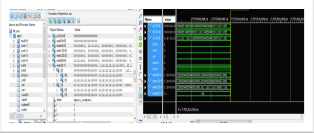
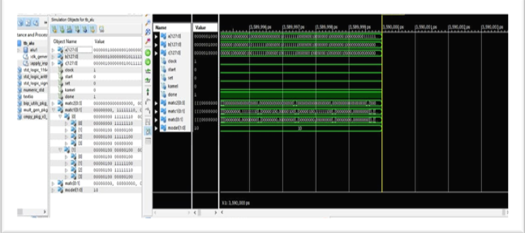
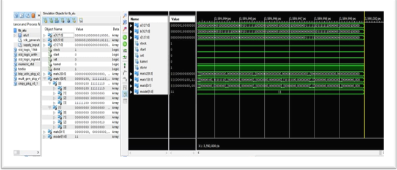

# Complex Matrix ALU Without ipcore
Xilinx ISE, vhdl

In this part of the project we implement an ALU for Complex Matrix without using ipcores.

## Multiplication

$A= a + bi$ 
$B = c + di$ 
$C = (ac-bd) + (ad+bc)i$ 

## Addition

## Subtraction

